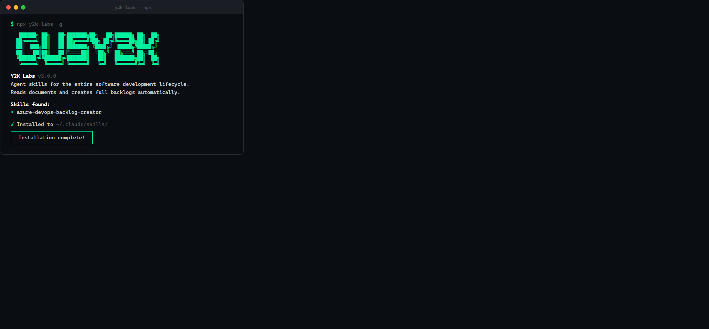

# Y2K Labs

<p align="center">
  
</p>

<p align="center">
  Agent skills for the entire software development lifecycle.
</p>

<p align="center">
  <a href="https://www.npmjs.com/package/y2k-labs"></a>
  <a href="https://www.npmjs.com/package/y2k-labs"></a>
  <a href="https://github.com/GusY2K/y2k-labs/stargazers"></a>
  <a href="https://github.com/GusY2K/y2k-labs"></a>
</p>

---

## Install

```bash
npx y2k-labs -g
```

Works with **Claude Code, Cursor, GitHub Copilot, Windsurf, Cline**, and [40+ AI agents](https://github.com/vercel-labs/skills).

---

## Skills

### Azure DevOps

Skills for Product Owners, Scrum Masters, and teams working with Azure DevOps Boards.

| Skill | Description |
|-------|-------------|
| [azure-devops-backlog-creator](./skills/azure-devops-backlog-creator/) | Reads any document (PRD, spec, meeting notes) and creates a full backlog hierarchy: Epics → Features → User Stories → Tasks → Bugs with parent-child links, acceptance criteria, and story points |
| [backlog-health-audit](./skills/backlog-health-audit/) | Scans an existing Azure DevOps backlog and generates a health report (0-100 score) identifying missing acceptance criteria, orphaned tasks, stale items, duplicates, and 8 more issue types |
| [sprint-planner](./skills/sprint-planner/) | Reads the backlog and suggests optimal sprint assignments based on team velocity, priority ordering, and dependency analysis |
| [work-item-templates](./skills/work-item-templates/) | 18 pre-built templates for common patterns: API endpoint, CRUD feature, auth flow, database migration, CI/CD pipeline, dashboard, and more |

<!-- ### Frontend (coming soon) -->
<!-- ### Backend (coming soon) -->
<!-- ### DevOps (coming soon) -->
<!-- ### Testing (coming soon) -->

---

## How Skills Work

Each skill is a `SKILL.md` file that gives your AI agent specialized knowledge. When you install Y2K Labs, the skills are copied to your agent's config directory. The agent loads them automatically based on context.

**Slash command:**
```
/azure-devops-backlog-creator path/to/document.md
```

**Natural language (auto-detected):**
> "Read this PRD and create the backlog in Azure DevOps"
>
> "Audit my backlog health"
>
> "Plan the next 3 sprints"
>
> "Create a CRUD feature template for Products"

---

## Update

```bash
npx y2k-labs@latest -g
```

---

## Multi-Runtime Support

The installer creates the correct config files for each runtime automatically:

| Runtime | Config Location |
|---------|----------------|
| **Claude Code** | `~/.claude/skills/<name>/` |
| **Cursor** | `.cursor/rules/` |
| **GitHub Copilot** | `.github/copilot-instructions/` |
| **Windsurf** | `.windsurf/rules/` |
| **Cline** | `~/.cline/skills/<name>/` |

```bash
npx y2k-labs -g --agent=cursor
npx y2k-labs -g --agent=copilot
npx y2k-labs -g --agent=all
```

---

## Team Setup

```bash
# Everyone on the team runs:
npx y2k-labs -g
```

---

## Prerequisites (Azure DevOps skills)

| # | Requirement | Install |
|---|-------------|---------|
| 1 | Azure CLI | [Install guide](https://learn.microsoft.com/en-us/cli/azure/install-azure-cli) |
| 2 | DevOps extension | `az extension add --name azure-devops` |
| 3 | Authentication | `az login` or set `AZURE_DEVOPS_EXT_PAT` env var |
| 4 | Defaults | `az devops configure --defaults organization=https://dev.azure.com/ORG project=PROJECT` |

---

## Contributing

Want to add a skill? Every skill is a folder with a `SKILL.md`:

```
skills/
└── my-new-skill/
    ├── SKILL.md              # Required — frontmatter + instructions
    ├── references/            # Optional — detailed documentation
    ├── scripts/               # Optional — executable helpers
    ├── examples/              # Optional — sample inputs/outputs
    └── assets/                # Optional — templates, data files
```

1. Fork this repo
2. Create your skill folder in `skills/`
3. Add a `SKILL.md` with `name` and `description` in YAML frontmatter
4. Update `.claude-plugin/marketplace.json`
5. Submit a PR

---

## Changelog

See [CHANGELOG.md](./CHANGELOG.md) for version history.

---

## License

Apache-2.0 — see [LICENSE.txt](./LICENSE.txt)
